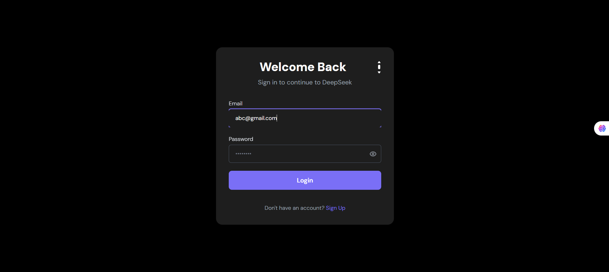
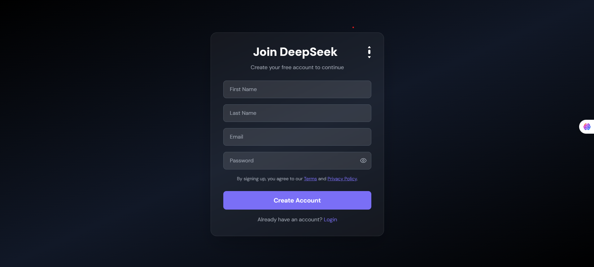
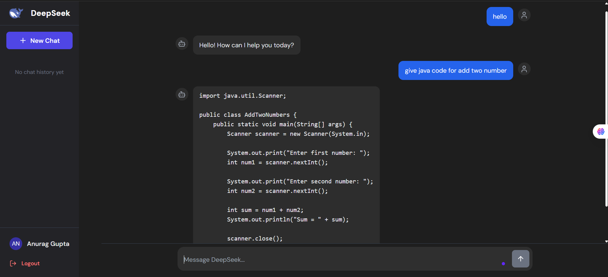

# 🚀 Deepseek AI Clone (Moonshot AI)

A **AI-powered Deepseek AI clone** for chat-based research, code generation, and workflow automation, inspired by Deepseek.

🌐 **Live Demo:**(https://deepseek-ai-clone.netlify.app/)

---

## 🖼️ Demo Screenshots

> Add your screenshots here for a professional touch:
> 




---

## ✨ Features

✅ User Authentication (Signup, Login, JWT-based session management)  
✅ Chat interface with Moonshot AI backend integration  
✅ Code generation, summarization, and workflow capabilities  
✅ Conversation history with save/load functionality  
✅ Theme toggle and responsive design for mobile/desktop  
✅ Clean, modern UI with **React + Tailwind CSS**  
✅ Backend API using **Node.js, Express.js, MongoDB**  
✅ Toast notifications for seamless UX

---

## ⚙️ Tech Stack

- **Frontend:** React, Redux Toolkit, Tailwind CSS, Sonner (toast notifications)
- **Backend:** Node.js, Express.js, MongoDB (Mongoose)
- **AI:** Moonshot AI API (for chat, code, and summarization)
- **Deployment:** Netlify (Frontend), Render (Backend)

---

## 🚀 Getting Started Locally

### 1️⃣ Clone the repository

```bash
git clone https://github.com/Anurag888000/Deepseek-AI-Clone.git
cd Deepseek-AI-Clone
